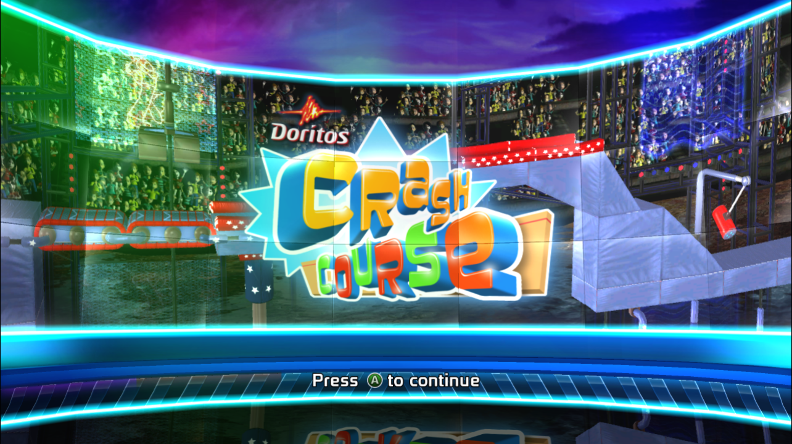
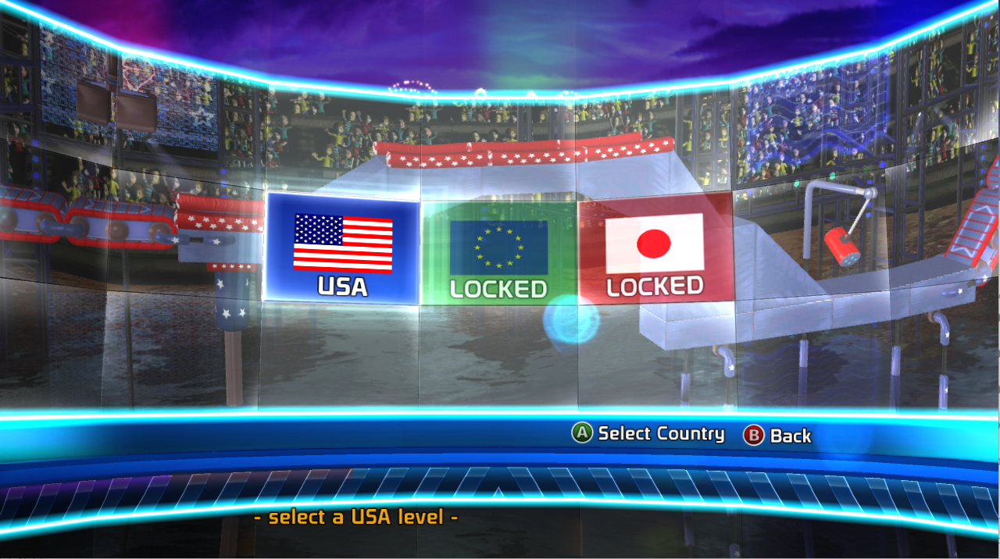

# Doritos Crash Course ReXGlue Bring-Up

Private Windows recompilation bring-up for Doritos Crash Course using the Xbox 360 ReXGlue SDK.

## Current Status

- ReXGlue codegen completes successfully against `default.xex_uncrypted.xex`.
- Generated Debug build links as `build/bin/Debug/doritos_port.exe`.
- Runtime reaches the title screen and advances to country/level selection.
- Stable in-game state confirmed: country/level selection remains alive with D3D12 rendering and no failed draw diagnostics in the checked run.
- Actual obstacle-course gameplay is not yet confirmed.

## Screenshots






## Performance

See [docs/performance.md](docs/performance.md) for the current measured runtime state.

## Important Asset Note

Original game files are intentionally not included in this repository. To reproduce locally, provide a legally sourced copy of the game under `assets/game/` with `default.xex_uncrypted.xex` and the required marketplace/content files.

The clean source package under `game/` and the working copy under `assets/game/` are ignored by Git.

## Key Paths

- Port scaffold: `src/`
- ReXGlue config: `port/rexglue-config/doritos_port.toml`
- Generated code: `port/generated/`
- Build helper: `tools/build.ps1`
- Runtime helper: `tools/run.ps1`
- Asset verifier: `tools/verify_game_files.py`
- Metadata extractor: `tools/extract_metadata.py`

## Repro Commands

```powershell
py -3 .\tools\verify_game_files.py --json
powershell -NoProfile -ExecutionPolicy Bypass -File .\tools\codegen.ps1
powershell -NoProfile -ExecutionPolicy Bypass -File .\tools\build.ps1 -Config Debug
powershell -NoProfile -ExecutionPolicy Bypass -File .\tools\run.ps1 -Config Debug -GameRoot .\assets\game -Visible -NoConsole -MnkMode -WindowWidth 1280 -WindowHeight 720 -LogLevel info -GraphicsBackend d3d12 -AudioBackend nop -NetworkingMode disabled -TimeoutSeconds 0
```

For keyboard verification, hold Space for Xbox A. Quick taps can be missed by the current MnK bridge.

## Easy Launcher

On Windows, double-click `Launch Doritos Crash Course.bat` from the repo root.

The launcher checks `assets/game/`, builds Debug if needed, and starts the port with the current stable defaults: D3D12 graphics, NOP audio, disabled networking, keyboard-to-controller input, and a 1280x720 window.

For a fresh public clone, add your local game files first and run `tools\codegen.ps1` before using the launcher. If `build/bin/Debug/doritos_port.exe` is missing, the launcher can build it only after `port/generated/sources.cmake` exists.
